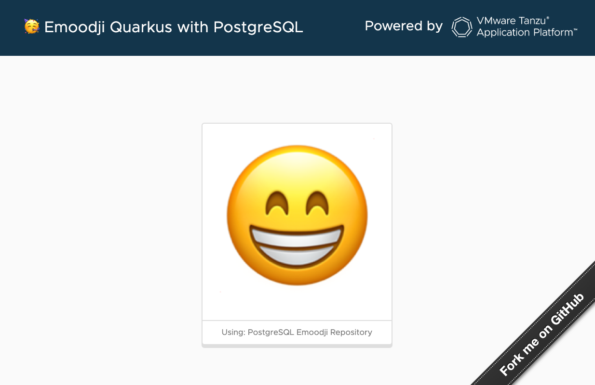

Welcome to Emoodji Quarkus!

This project is an extension of [Emoodji](https://github.com/alexandreroman/emoodji)
(a Spring Boot 3.0 app), this time built with [Quarkus](https://quarkus.io/).

This page describes how to deploy this app to [VMware Tanzu Application Platform](https://tanzu.vmware.com/application-platform)
and bind it to a PostgreSQL database.

You can even use both Emoodji and Emoodji Quarkus bound to the same database.

## How to use it?

### Run on your workstation

This app expects to have a PostgreSQL database running on localhost:

```shell
docker run --rm -p 5432:5432 -e POSTGRES_PASSWORD=changeme postgres:13
```

Run this command to start the app in `dev` mode (including live coding):

```shell
mvn quarkus:dev
```

The app is available at http://localhost:8080.

Every time you click on the emoji face, a REST request is sent to the app, incrementing a counter
which is persisted into a database.

### Deploy the app to TAP

As a platform operator, you need to deploy a PostgreSQL database first.

Create a PostgreSQL database instance leveraging the Bitnami Helm chart
in the TAP developer namespace:

```shell
helm repo update && \
helm upgrade emoodji-db-postgres bitnami/postgresql -n $TAP_NS --version 12.1.13 --install -f config/app-operator/postgresql-values.yaml
```

Note the password for accessing the database: `changeme`.

Along with this database instance, let's a create a binding secret:

```yaml
apiVersion: v1
kind: Secret
metadata:
  name: emoodji-db-postgres-binding
type: Opaque
stringData:
  type: postgresql
  provider: sample
  host: emoodji-db-postgres-postgresql
  database: postgres
  port: "5432"
  username: postgres
  password: changeme
```

These are the informations you need in a workload in order to connect to the database.
This feature comes from the [Service Binding](https://servicebinding.io/) project:
an industry effort to standardize access to services for Kubernetes apps.
TAP provides a default implementation for Service Binding.

Deploy this secret to the developer namespace.

Now let's create a claimable service, so that TAP workloads can use
this database:

```shell
tanzu service claim create emoodji-db-postgres-claim \
--resource-name emoodji-db-postgres-binding \
--resource-kind Secret --resource-api-version v1 -n $TAP_NS
```

You've just run the past commands as a platform operator.
Developers don't have to deal with these details.

Time to change your hat: let's pretend you're a developer now!

Deploy the workload (this app is bound to the PostgreSQL database instance by default):

```shell
tanzu apps workload apply -n $TAP_NS -f config/workload.yaml
```

You're done!

TAP will take care of binding your app to the right service, by automatically
injecting service credentials. As a developer, you have no idea
when this service comes from. You just want to use it for your app.

Hope it helps!

## Contribute

Contributions are always welcome!

Feel free to open issues & send PR.

## License

Copyright &copy; 2023 [VMware, Inc. or its affiliates](https://vmware.com).

This project is licensed under the [Apache Software License version 2.0](https://www.apache.org/licenses/LICENSE-2.0).
